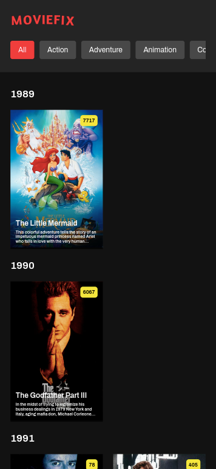

# TMDB Movie Explorer

This project is a simple React application that fetches and displays movies from The Movie Database (TMDB) API. Users can filter movies based on genres and view movies grouped by their release years.

## Table of Contents

- [TMDB Movie Explorer](#tmdb-movie-explorer)
  - [Table of Contents](#table-of-contents)
  - [Demo](#demo)
  - [Features](#features)
  - [Installation](#installation)
  - [Usage](#usage)
  - [Components](#components)
    - [1. `MovieContainer`](#1-moviecontainer)
    - [2. `MovieGenre`](#2-moviegenre)
    - [3. `MovieList`](#3-movielist)
    - [4. `Loader`](#4-loader)
  - [API Reference](#api-reference)
    - [Notes:](#notes)

## Demo




## Features

- Fetch movies from the TMDB API.
- Filter movies by genre.
- View movies grouped by release year.
- Scroll to a specific year (2012) when movies are loaded.
- Responsive design.

## Installation

1. Clone the repository:

   ```bash
   git clone https://github.com/yourusername/tmdb-movie-explorer.git
   cd tmdb-movie-explorer
   ```

2. Install dependencies:

   ```bash
   npm install
   ```

## Usage

1. Get your TMDB API key by signing up at [TMDB](https://www.themoviedb.org/).

2. Add your API key in the `MovieList` and `MovieGenre` components where the `axios` requests are made.

3. Start the development server:

   ```bash
   npm start
   ```

4. Open your browser and go to `http://localhost:3000`.

## Components

### 1. `MovieContainer`

This component manages the overall state and renders `MovieGenre` and `MovieList` components.

### 2. `MovieGenre`

This component fetches and displays available genres from the TMDB API. It allows users to select or deselect genres.

### 3. `MovieList`

This component fetches and displays a list of movies based on selected genres. It groups movies by their release year and scrolls to the year 2012 when movies are loaded.

### 4. `Loader`

This component displays a loading spinner while data is being fetched.

## API Reference

The application uses the TMDB API to fetch genres and movies. Here are the main endpoints:

- **Get Genres**: `https://api.themoviedb.org/3/genre/movie/list`
- **Discover Movies**: `https://api.themoviedb.org/3/discover/movie`

### Notes:

1. **Additional Data**: The API did not provide some additional data such as cost and director. The current implementation includes the movie name, description, and vote count.
2. **Performance**: To ensure better performance and faster load times, only a limited number of pages are fetched and displayed.
3. **Styling with SCSS**: The project uses SCSS instead of regular CSS for better readability and maintainability of the styling code. SCSS provides various features like variables, nesting, and mixins, which make the code more modular and easier to manage.

